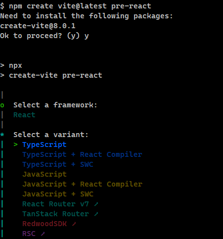
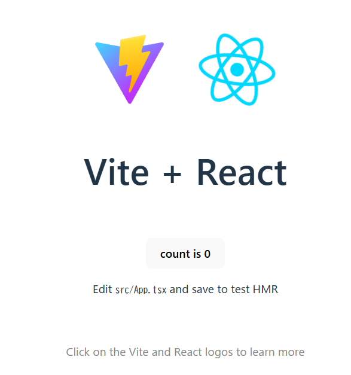

# Reactプロジェクト立ち上げ方法

- Viteのパッケージを利用してプロジェクトを立ち上げます。
- Viteはモダンなウェブプロジェクトのために素早くかつスリムな開発体験を提供することを目指したビルドツールです。

## 環境構築手順
```sh
## プロジェクト作成
npm create vite@latest [プロジェクト名]

$ npm create vite@latest pre-react
Need to install the following packages:
create-vite@8.0.1
Ok to proceed? (y) y
> npx
> create-vite pre-react
|
o  Select a framework:
|  React
|
*  Select a variant:
|  > TypeScript
o  Use rolldown-vite (Experimental)?:
|  No
|
o  Install with npm and start now?
|  No
|

## projectディレクトリへ移動
cd pre-react

## 依存関係のインストール
npm install

## 開発サーバーの起動
npm run dev

## ブラウザで下記のurlを開く
http://localhost:5173/

```





## Tailwind CSS の導入
```sh
## tailswindcssのインストール
npm install tailwindcss @tailwindcss/vite
```

### src/index.css を編集
```css
@import "tailwindcss";
```

### tsconfig.jsonを編集
```json
{
  "files": [],
  "references": [
    { "path": "./tsconfig.app.json" },
    { "path": "./tsconfig.node.json" }
  ],
  "compilerOptions": {
    "baseUrl": ".",
    "paths": {
      "@/*": ["./src/*"]
    }
  }
}

```

### tsconfig.app.jsonファイルを編集
```json
{
  "compilerOptions": {
    "tsBuildInfoFile": "./node_modules/.tmp/tsconfig.app.tsbuildinfo",
    "target": "ES2022",
    "useDefineForClassFields": true,
    "lib": ["ES2022", "DOM", "DOM.Iterable"],
    "module": "ESNext",
    "types": ["vite/client"],
    "skipLibCheck": true,

    /* Bundler mode */
    "moduleResolution": "bundler",
    "allowImportingTsExtensions": true,
    "verbatimModuleSyntax": true,
    "moduleDetection": "force",
    "noEmit": true,
    "jsx": "react-jsx",

    /* Linting */
    "strict": true,
    "noUnusedLocals": true,
    "noUnusedParameters": true,
    "erasableSyntaxOnly": true,
    "noFallthroughCasesInSwitch": true,
    "noUncheckedSideEffectImports": true,
    
    /* tailswindcss*/
    "baseUrl": ".",
    "paths": {
      "@/*": [
        "./src/*"
      ]
    }
  },
  "include": ["src"]
}

```

### vite.config.ts を更新
- アプリがエラーなしでパスを解決できるように、次のコードを vite.config.ts に追加
```sh
npm install -D @types/node
```

- vite.config.tsを編集
```ts
import path from "path"
import tailwindcss from "@tailwindcss/vite"
import { defineConfig } from 'vite'
import react from '@vitejs/plugin-react'

// https://vite.dev/config/
export default defineConfig({
  plugins: [react(), tailwindcss()],
  resolve: {
    alias: {
      "@": path.resolve(__dirname, "./src"),
    },
  },
})

```

### shadcnプロジェクトをセットアップ
```sh
npx shadcn@latest init

$ npx shadcn@latest init
Need to install the following packages:
shadcn@3.3.1

## 2つ質問される
## 質問1
Ok to proceed? (y) y

√ Preflight checks.
√ Verifying framework. Found Vite.
√ Validating Tailwind CSS config. Found v4.
√ Validating import alias.
## 質問2
√ Which color would you like to use as the base color? » Neutral
√ Writing components.json.
√ Checking registry.
√ Updating CSS variables in src\index.css
√ Installing dependencies.
√ Created 1 file:
  - src\lib\utils.ts
```

### コンポーネントを追加
```sh
## buttonコンポーネントを追加
npx shadcn@latest add button

## コンポーネントを選んで追加
npx shadcn@latest add
```

##

# 参考
- [公式：ゼロからの React アプリ構築](https://ja.react.dev/learn/build-a-react-app-from-scratch)
- [公式：vite](https://vite.dev/guide/)
- [公式：ui.shadcn](https://ui.shadcn.com/docs/installation/vite)